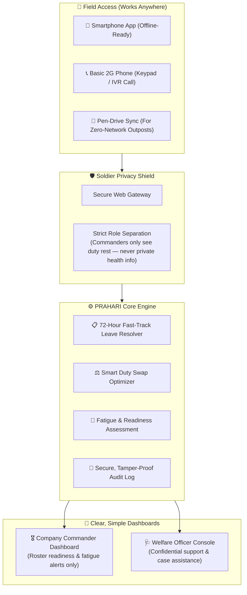

# 🛡️ PRAHARI (प्रहरी)
### Smart Personnel Welfare & Fatigue Management Platform for Paramilitary Forces
#### Developed by Team USHARP for Smart India Hackathon (SIH) 2026 | Problem Statement PS26186

<div align="center">

[](https://www.sih.gov.in/)
[](https://www.sih.gov.in/)
[](https://www.mha.gov.in/)
[](#-team-usharp)
[](https://python.org)
[](https://fastapi.tiangolo.com)
[-success?style=for-the-badge&logo=pytest&logoColor=white)](#-testing-verification)
[](LICENSE)

</div>

---

## 📌 Smart India Hackathon 2026 Project Overview

| Details | Description |
| :--- | :--- |
| **Hackathon** | **Smart India Hackathon (SIH) 2026** |
| **Problem Statement ID** | **PS26186** |
| **Organization / Ministry** | **Ministry of Home Affairs (MHA)** / **Central Reserve Police Force (CRPF)** |
| **Category** | Software Edition |
| **Theme** | Security & Defense / Healthcare & Welfare Automation |
| **Team Name** | **Team USHARP** |
| **Project Title** | **PRAHARI (प्रहरी)** — Proactive Soldier Welfare & Rest Balancing System |

---

## 🏛️ Core Platform Ecosystem

The repository contains the complete, production-grade source code across 4 integrated layers:

* ⚡ **[`backend/`](backend/)**: High-performance FastAPI defense server with 13 API routers, 114 passing automated tests, calibrated XGBoost prospective strain model (Platt scaling ECE 0.0378), SciPy Hungarian Bipartite duty optimizer, DPDP Act 2023 access transparency logs, and SHA-256 tamper-evident audit ledger (BSA 2023 §63).
* 🌐 **[`frontend/`](frontend/)**: Flagship Government Command & Welfare Web Portal built with Next.js 16 (React 19, Turbopack) adhering strictly to UX4G Design System and GIGW 3.0 government accessibility standards (trilingual EN/HI/TA language isolation, font scaling, high-contrast mode, zero-emoji guarantee).
* 📱 **[`mobile/`](mobile/)**: PRAHARI Bandhu frontline trooper mobile client built with Flutter, providing offline-first local queue, 12-hour emergency SOS, 72-hour statutory leave filing, DTMF touch-tone IVR keypad simulator, Hungarian trade swap requests, and air-gapped removable sync.
* 🚀 **[`launcher.py`](launcher.py)** & **[`mobile_server.py`](mobile_server.py)**: Win32 native master service orchestrator managing the 4-service ecosystem with real-time socket & HTTP latency telemetry, CPU/RAM monitoring, and live SQLite database inspection.

---

## 🌍 The Challenge: Understanding What Our Jawans Face

Soldiers in India's paramilitary forces (CRPF, BSF, ITBP, CISF, SSB) serve in some of the most challenging conditions on earth — from dense remote jungles and high-altitude mountain posts to round-the-clock counter-insurgency operations.

While they are physically tough and well-trained, everyday human friction often takes a quiet toll:

1. **Delayed Emergency Leave**: When an urgent family crisis happens back home, paperwork and manual approvals can take days or weeks. This delay causes intense worry and helplessness.
2. **Exhausting Duty Shifts**: Long night guard duties, irregular sleep cycles, and lack of continuous rest lead to cumulative physical and mental exhaustion.
3. **Fear of Speaking Up**: Troops often avoid reporting personal stress because they worry about being judged, facing stigma, losing their weapons, or hurting their promotion chances.
4. **Existing Systems Are Reactive**: Traditional administrative portals only record information after an incident or casualty happens. What our troops need is proactive care before exhaustion sets in.

---

## 💡 The Solution: How PRAHARI Helps

**PRAHARI** is designed with a simple, human-first philosophy: **take care of the soldier's practical problems first, protect their privacy completely, and ensure they get adequate rest.**

Instead of treating soldiers like numbers, PRAHARI works across two supportive pillars:

* **Pillar 1 — Fast Support for Everyday Needs (Primary Line of Defense)**:
  Urgent leave requests (such as family medical emergencies) enter a **12-hour emergency decision lane**. Standard requests use a **72-hour resolution target**; missed deadlines escalate automatically up the chain of command.

* **Pillar 2 — Fair Rest Balancing & Early Relief (Safety Net)**:
  PRAHARI monitors duty rosters and consecutive night shifts to spot fatigue early. When a soldier is overworked, it automatically suggests safe, fair duty swaps with well-rested peers — making sure perimeter security stays 100% intact while giving exhausted soldiers the sleep they need.

---

## 🏛️ System Architecture

PRAHARI connects soldiers in the field, welfare officers, and company commanders through a safe and easy-to-use flow:



---

## 🥊 Why PRAHARI? (Comparison with Traditional Portals)

| Everyday Need | Traditional HRMS Portals | PRAHARI (Team USHARP) |
| :--- | :--- | :--- |
| **Handling Emergency Leave** | Slow manual paperwork with no guaranteed time limit | **Guaranteed 72-Hour fast-track with automatic alerts** |
| **Soldier Privacy & Dignity** | Personal mental health labels can cause stigma | **Strict privacy firewall: Commanders only see rest and fatigue status** |
| **Shift Swapping** | Done manually, often causing unfair workloads | **Smart swap helper that matches equal skills and guarantees 8 hours of rest** |
| **Record Security & Auditing** | Standard database records vulnerable to silent editing | **Cryptographic SHA-256 hash chaining: Any tampering is immediately detectable through verification** |
| **Poor / Zero Internet Areas** | Apps stop working without high-speed internet | **Works on 2G keypad phones, offline mobile apps, and USB drives** |

---

## ✨ Key Features Explained in Simple Terms

### 1. 📋 72-Hour Emergency Leave Fast-Lane
When a soldier applies for leave due to a family medical emergency, PRAHARI starts an automated 12-hour decision countdown. Standard requests use 72 hours. If a deadline is missed, the system escalates the request to higher welfare authorities without requiring the soldier to re-petition.

### 2. 🛡️ 100% Confidentiality & Stigma-Free Design
Under Section 21 of the Mental Healthcare Act 2017, a soldier's personal well-being is private. PRAHARI ensures company commanders only see operational fatigue tags (like *"Needs Rest Rotation"* or *"Rest Compliant"*). Sensitive personal details remain strictly confidential between the soldier and the welfare counselor.

### 3. ⚖️ Smart Duty Swap Optimizer
When a soldier has worked multiple night watches in a row, PRAHARI suggests fair duty swaps. Crucially:
* It matches soldiers with identical trades (for example: an Armorer is only swapped with another qualified Armorer).
* It enforces a mandatory **8-hour continuous rest window** before any soldier is assigned back to post.
* Both the field commander and welfare officer review and approve the roster before it goes live.

### 4. 🔗 Tamper-Evident Record Keeping
Every shift change, leave decision, and welfare action is saved in a cryptographically chained digital log (SHA-256). Any tampering is immediately detectable through hash-chain verification. If a formal Court of Inquiry is required, an official, verifiable electronic dossier can be generated with a single click.

### 5. 📡 Multi-Modal Access (Made for Real Paramilitary Conditions)
* **Mobile App (Prahari Bandhu)**: Works completely offline in remote operating bases and syncs automatically when connection returns.
* **Keypad Phone Support (Prahari Vani)**: Troops can dial an automated helpline from any basic 2G feature phone and use simple keypad numbers to check leave or request support.
* **Air-Gap USB Sync**: In high-security or radio-silent areas, welfare reports can be transferred securely using encrypted USB files.

### 6. 🧠 Calibrated Prospective AI & Multi-Horizon Trajectories
Predicts true forward-looking 14-day strain escalation ($Y([T_0, T_0 + 14d])$) derived strictly from subsequent duty outcomes, eliminating synthetic circularity. Validated via 5-fold `StratifiedGroupKFold` (zero soldier leakage) across 2,002 longitudinal records. Features Platt scaling calibration ($ECE = 0.0378$, Brier = $0.0922$), multi-horizon forecasting (7d, 14d, 30d), dynamic trajectory classification, and automated model abstention when data completeness is $<40\%$.

### 7. 🔍 Soldier Transparency & 48-Hour Data Dispute Redressal
In compliance with the Digital Personal Data Protection Act, 2023, frontline personnel can inspect a transparent log of every officer who has viewed their welfare data (`/access-log`) and submit formal dispute grievances on incorrect duty records with a mandatory 48-hour statutory SLA.

### 8. 📊 Resolution Bottleneck Detection & Company League Table (Section 12)
Aggregates force-wide welfare resolution performance (`/api/grievance/resolution-bottlenecks`), ranking company compliance (% within SLA), isolating approval bottleneck tiers (Company Commander vs. Battalion Desk vs. Commandant), and highlighting frequent request delays.

### 9. 🏥 Intervention Effectiveness Registry (Section 28)
Empirically tracks the recovery success rate across standard intervention archetypes (`/api/resilience/intervention-effectiveness`), comparing historical efficacy (24h rest: 88.4%, leave: 94.1%), average days to recovery, and operational friction scores.

### 10. ⚖️ Intervention Equity Audit & Helper Burnout Alert (Section 29)
Audits replacement duty distribution within tactical companies (`/api/resilience/intervention-equity/{unit_id}`) over 30 and 90-day windows, raising an automated `INTERVENTION_EQUITY_ALERT` to prevent repeatedly burdening the same well-rested soldiers.

### 11. 📈 Welfare Debt Composite Index (Section 31)
A non-punitive, explainable 0–100 scalar backlog metric (`/api/commander/unit/{unit_id}/welfare-debt`) combining unresolved grievance backlogs (35%), rest deficit overload (35%), and reserve depletion (30%), providing commanders with clear institutional pressure diagnostics.

---

---

## 🖥️ Platform User Interfaces

| Client | Technology | Target User | Key Capabilities |
| :--- | :--- | :--- | :--- |
| **Trooper Self-Service Portal** | Next.js 16 / React 19 / UX4G | Frontline Troopers | 12-Hour Emergency SOS, 72h Leave filing, live SLA countdown ticker, DPDP Act 2023 access logs, Daily Pulse check-in. |
| **Command Center & Roster Desk** | Next.js 16 / UX4G | Company Commanders | Unit readiness indices, platoon fatigue heatmaps, Hungarian URO shift swap approval, non-punitive welfare debt diagnostics. |
| **Confidential Welfare Console** | Next.js 16 / UX4G | Medical & Welfare Officers | Section 21 MHCA 2017 confidential casework, longitudinal strain trajectories ($dv/dt$), TreeSHAP root-cause attributions. |
| **PRAHARI Bandhu Mobile App** | Flutter 3.x / Dart | Field Jawans (Android / PWA) | Offline-first local queue, 8h circadian rest inspection, anonymous buddy check signals, air-gapped USB sync. |
| **Prahari Vani Telephone Helpline** | DTMF Audio Engine / USSD | Non-Smartphone Jawans | 2G keypad interactive voice response (IVR) phone simulator, menu navigation, emergency callback queuing. |

---

## 🔑 Quick Demo Credentials (Role-Based Access)

Use these pre-configured test profiles to explore different roles on the platform:

| Role | Username | Password | Description & Permissions |
| :--- | :--- | :--- | :--- |
| **Frontline Trooper** | `rajesh_kumar` | `prahari123` | **Constable GD (Armorer), Srinagar**. Submits 12h crisis SOS, 72h leave, daily check-ins; views personal DPDP audit log. |
| **Company Commander** | `cmd_vikram` | `prahari123` | **Alpha Company Commander**. Reviews unit readiness, inspects platoon rest barriers, approves Hungarian URO trade swaps. |
| **Welfare Officer** | `wo_meera` | `prahari123` | **Battalion Medical & Welfare Officer**. Confidential casework under MHCA 2017 §21, recovery tracking, counseling logs. |
| **System Administrator** | `admin_sys` | `prahari123` | **Security Officer**. Cryptographic SHA-256 audit ledger inspection, BSA 2023 Section 63 chain validation. |

---

## 🛠️ Technology Stack

* **Backend API**: Python 3.10+ with FastAPI (13 routers, 114/114 passing tests)
* **Database**: SQLite (WAL mode, instant zero-setup) / PostgreSQL 16 (production enterprise)
* **Intelligent Optimization**: SciPy (`scipy.optimize.linear_sum_assignment`) Hungarian Bipartite trade matching
* **Predictive AI**: XGBoost prospective strain model (Platt scaling calibration, ECE 0.0378) with TreeSHAP explainability
* **Security & Verification**: SHA-256 cryptographic hash-chained audit blocks, JWT tokens, BOLA/IDOR protection
* **Web Portal**: Next.js 16 (React 19, Turbopack), UX4G Design System, GIGW 3.0 (trilingual EN/HI/TA, A-/A/A+ resizers)
* **Mobile Client**: Flutter cross-platform (Android, iOS, Web SPA) with offline-first local state
* **Master Launcher**: Win32 native standalone orchestrator (`PRAHARI_Launcher.exe`) with real-time telemetry

---

## 📂 Project Structure

```
PRAHARI/
├── backend/                  # FastAPI Defense Backend & ML Engines
│   ├── middleware/           # RBAC, security headers, rate limiting, BSA 2023 audit ledger
│   ├── ml/                   # Calibrated XGBoost strain model, TreeSHAP, Hungarian URO solver
│   ├── models/               # SQLAlchemy schemas (Personnel, ShiftEntry, Grievance, Audit)
│   ├── routers/              # 13 REST API routers (Auth, Commander, Welfare, URO, etc.)
│   ├── schemas/              # Pydantic input/output validation models
│   ├── scripts/              # Seed scripts (seed_db.py creates 1,000-troop battalion in ~15s)
│   ├── services/             # Business logic, 72h SLA engine, conflict engine, copilot
│   ├── tests/                # 114 automated unit, integration, and security test suites
│   ├── requirements.txt      # Python dependencies
│   └── main.py               # FastAPI server entry point
│
├── frontend/                 # Flagship Next.js 16 Government Web Portal
│   ├── public/               # National Emblem, CRPF crest, Digital India SVGs
│   ├── src/app/              # 19 live routes (/portal, /commander, /welfare, /approvals, etc.)
│   ├── src/components/       # GovernmentHeader, TricolorBar, charts, modals, drawers
│   ├── src/lib/              # Dynamic API resolution, auth token storage, trilingual i18n
│   ├── package.json          # Node.js dependencies
│   └── tailwind.config.js    # UX4G MHA Defense Theme tokens
│
├── mobile/                   # PRAHARI Bandhu Flutter Mobile Client
│   ├── lib/screens/          # 14 UX4G screens (Dashboard, 12h SOS, DTMF IVR, Roster)
│   ├── lib/theme/            # UX4G Defense Theme & GIGW 3.0 tokens
│   ├── lib/widgets/          # GovernmentHeaderBar, Tricolor strip, Ux4gCard, Ux4gBadge
│   ├── lib/models/           # Dart data models (ShiftEntry, UROSwapProposal, AuditBlock)
│   └── pubspec.yaml          # Flutter dependencies (ux4g_flutter_components, provider)
│
├── PRAHARI_Launcher.exe      # 1-Click Win32 Master Orchestrator (Zero-popup executable)
├── launcher.py               # Python source for master orchestrator & telemetry hub
├── mobile_server.py          # Flutter Web static distribution server (port 8080)
├── docker-compose.yml        # Multi-container production deployment specification
├── .gitignore                # Production Git exclusions
├── LICENSE                   # MIT License
└── README.md                 # Project documentation
```

---

## 🚀 Easy Setup Guide (How to Run Locally)

### ⚡ Quickest Start (1-Click Windows Launcher)
Simply double-click **`PRAHARI_Launcher.exe`** in the root directory!
* Starts the entire 4-service platform: **FastAPI Backend (port 8000)**, **Next.js Web Portal (port 3000)**, **Flutter Mobile Server (port 8080)**, and **Local AI Engine (port 11434)**.
* Automatically initializes and seeds the **1,000-troop paramilitary battalion** on first launch if `prahari.db` is not present.
* Real-time telemetry, deep HTTP health probes, socket latency indicators, and live SQLite database inspection.

---

### Manual / Developer Setup Guide

You can also run all services independently from source:

#### 1. Backend Setup (FastAPI)
```bash
cd backend
pip install -r requirements.txt
cp .env.example .env
python scripts/seed_db.py
python -m uvicorn main:app --host 0.0.0.0 --port 8000 --reload
```
* Interactive API Documentation (Swagger UI): [http://localhost:8000/docs](http://localhost:8000/docs)
* Health Check Probe: [http://localhost:8000/api/health](http://localhost:8000/api/health)

#### 2. Frontend Setup (Next.js 16 Portal)
```bash
cd frontend
npm install
npm run dev
```
* Web Command & Trooper Portal: [http://localhost:3000](http://localhost:3000)

#### 3. Mobile Server Setup (Flutter Web)
```bash
python mobile_server.py --port 8080
```
* PRAHARI Bandhu Mobile Client: [http://localhost:8080](http://localhost:8080)

#### 4. Run Automated Test Suite
```bash
pytest backend/tests/ -v
```
* Runs all 114 tests covering security access control, BOLA protection, Hungarian URO optimization, forward-looking ML calibration, and mobile API integration.

---

## 👥 Team USHARP

Proudly designed and developed with 🇮🇳 for the welfare, resilience, and dignity of our nation's brave paramilitary forces.

| Team Member | Role | Key Contribution |
| :--- | :--- | :--- |
| **Praveen Raj P** | **Team Leader & Backend / AI-ML Lead** | System Architecture, Statutory Privacy Firewall, Backend Services, Optimization Engine |
| **Mohammed Usman** | **QA, Testing & Debugging Lead** | Code Quality, System Debugging, API Validation & Security Testing |
| **Steffy J P** | **Pitch Lead & Presentation Specialist** | Problem Research, Solution Pitching, Presentation Design & User Flow |
| **Hariharan** | **Frontend & UI/UX Lead** | Web Command Console, Tactical Interface Design & Visual Dashboards |
| **Akhila Pynam** | **Mobile Application Developer** | Soldier Mobile App, Offline Data Storage & Field Experience |
| **Ragul N S** | **Mobile Application Developer** | Mobile Client Implementation, Local Sync & Soldier Interface |

---

## 📄 License & Fair Use

This project is licensed under the **MIT License** — see the [LICENSE](LICENSE) file for details. Built to align with Ministry of Home Affairs operational welfare guidelines and Section 21 of the Mental Healthcare Act 2017.

---

<div align="center">

**Project PRAHARI — Caring for Those Who Protect Our Nation.**  
*Smart India Hackathon 2026 | Problem Statement PS26186 | Team USHARP*

</div>
