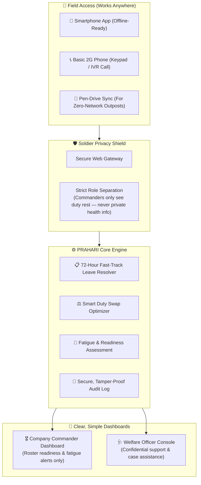

# 🛡️ PRAHARI (प्रहरी)
### Smart Personnel Welfare & Fatigue Management Platform for Paramilitary Forces
#### Developed by Team USHARP for Smart India Hackathon (SIH) 2026 | Problem Statement PS26186

<div align="center">

[](https://www.sih.gov.in/)
[](https://www.sih.gov.in/)
[](https://www.mha.gov.in/)
[](#-team-usharp)
[](https://python.org)
[](https://fastapi.tiangolo.com)
[-success?style=for-the-badge&logo=pytest&logoColor=white)](#-testing-verification)
[](LICENSE)

</div>

---

## 📌 Smart India Hackathon 2026 Project Overview

| Details | Description |
| :--- | :--- |
| **Hackathon** | **Smart India Hackathon (SIH) 2026** |
| **Problem Statement ID** | **PS26186** |
| **Organization / Ministry** | **Ministry of Home Affairs (MHA)** / **Central Reserve Police Force (CRPF)** |
| **Category** | Software Edition |
| **Theme** | Security & Defense / Healthcare & Welfare Automation |
| **Team Name** | **Team USHARP** |
| **Project Title** | **PRAHARI (प्रहरी)** — Proactive Soldier Welfare & Rest Balancing System |

---

## 🏛️ Core Platform Ecosystem

The repository contains the complete, production-grade source code across 4 integrated layers:

* ⚡ **[`backend/`](backend/)**: High-performance FastAPI defense server with 13 API routers, 114 passing automated tests, calibrated XGBoost prospective strain model (Platt scaling ECE 0.0378), SciPy Hungarian Bipartite duty optimizer, DPDP Act 2023 access transparency logs, and SHA-256 tamper-evident audit ledger (BSA 2023 §63).
* 🌐 **[`frontend/`](frontend/)**: Flagship Government Command & Welfare Web Portal built with Next.js 16 (React 19, Turbopack) adhering strictly to UX4G Design System and GIGW 3.0 government accessibility standards (trilingual EN/HI/TA language isolation, font scaling, high-contrast mode, zero-emoji guarantee).
* 📱 **[`mobile/`](mobile/)**: PRAHARI Bandhu frontline trooper mobile client built with Flutter, providing offline-first local queue, 12-hour emergency SOS, 72-hour statutory leave filing, DTMF touch-tone IVR keypad simulator, Hungarian trade swap requests, and air-gapped removable sync.
* 🚀 **[`launcher.py`](launcher.py)** & **[`mobile_server.py`](mobile_server.py)**: Win32 native master service orchestrator managing the 4-service ecosystem with real-time socket & HTTP latency telemetry, CPU/RAM monitoring, and live SQLite database inspection.

---

## 🌍 The Challenge: Understanding What Our Jawans Face

Soldiers in India's paramilitary forces (CRPF, BSF, ITBP, CISF, SSB) serve in some of the most challenging conditions on earth — from dense remote jungles and high-altitude mountain posts to round-the-clock counter-insurgency operations.

While they are physically tough and well-trained, everyday human friction often takes a quiet toll:

1. **Delayed Emergency Leave**: When an urgent family crisis happens back home, paperwork and manual approvals can take days or weeks. This delay causes intense worry and helplessness.
2. **Exhausting Duty Shifts**: Long night guard duties, irregular sleep cycles, and lack of continuous rest lead to cumulative physical and mental exhaustion.
3. **Fear of Speaking Up**: Troops often avoid reporting personal stress because they worry about being judged, facing stigma, losing their weapons, or hurting their promotion chances.
4. **Existing Systems Are Reactive**: Traditional administrative portals only record information after an incident or casualty happens. What our troops need is proactive care before exhaustion sets in.

---

## 💡 The Solution: How PRAHARI Helps

**PRAHARI** is designed with a simple, human-first philosophy: **take care of the soldier's practical problems first, protect their privacy completely, and ensure they get adequate rest.**

Instead of treating soldiers like numbers, PRAHARI works across two supportive pillars:

* **Pillar 1 — Fast Support for Everyday Needs (Primary Line of Defense)**:
  Urgent leave requests (such as family medical emergencies) enter a **12-hour emergency decision lane**. Standard requests use a **72-hour resolution target**; missed deadlines escalate automatically up the chain of command.

* **Pillar 2 — Fair Rest Balancing & Early Relief (Safety Net)**:
  PRAHARI monitors duty rosters and consecutive night shifts to spot fatigue early. When a soldier is overworked, it automatically suggests safe, fair duty swaps with well-rested peers — making sure perimeter security stays 100% intact while giving exhausted soldiers the sleep they need.

---

## 🏛️ System Architecture

PRAHARI connects soldiers in the field, welfare officers, and company commanders through a safe and easy-to-use flow:



---

## 🥊 Why PRAHARI? (Comparison with Traditional Portals)

| Everyday Need | Traditional HRMS Portals | PRAHARI (Team USHARP) |
| :--- | :--- | :--- |
| **Handling Emergency Leave** | Slow manual paperwork with no guaranteed time limit | **Guaranteed 72-Hour fast-track with automatic alerts** |
| **Soldier Privacy & Dignity** | Personal mental health labels can cause stigma | **Strict privacy firewall: Commanders only see rest and fatigue status** |
| **Shift Swapping** | Done manually, often causing unfair workloads | **Smart swap helper that matches equal skills and guarantees 8 hours of rest** |
| **Record Security & Auditing** | Standard database records vulnerable to silent editing | **Cryptographic SHA-256 hash chaining: Any tampering is immediately detectable through verification** |
| **Poor / Zero Internet Areas** | Apps stop working without high-speed internet | **Works on 2G keypad phones, offline mobile apps, and USB drives** |

---

## ✨ Key Features Explained in Simple Terms

### 1. 📋 72-Hour Emergency Leave Fast-Lane
When a soldier applies for leave due to a family medical emergency, PRAHARI starts an automated 12-hour decision countdown. Standard requests use 72 hours. If a deadline is missed, the system escalates the request to higher welfare authorities without requiring the soldier to re-petition.

### 2. 🛡️ 100% Confidentiality & Stigma-Free Design
Under Section 21 of the Mental Healthcare Act 2017, a soldier's personal well-being is private. PRAHARI ensures company commanders only see operational fatigue tags (like *"Needs Rest Rotation"* or *"Rest Compliant"*). Sensitive personal details remain strictly confidential between the soldier and the welfare counselor.

### 3. ⚖️ Smart Duty Swap Optimizer
When a soldier has worked multiple night watches in a row, PRAHARI suggests fair duty swaps. Crucially:
* It matches soldiers with identical trades (for example: an Armorer is only swapped with another qualified Armorer).
* It enforces a mandatory **8-hour continuous rest window** before any soldier is assigned back to post.
* Both the field commander and welfare officer review and approve the roster before it goes live.

### 4. 🔗 Tamper-Evident Record Keeping
Every shift change, leave decision, and welfare action is saved in a cryptographically chained digital log (SHA-256). Any tampering is immediately detectable through hash-chain verification. If a formal Court of Inquiry is required, an official, verifiable electronic dossier can be generated with a single click.

### 5. 📡 Multi-Modal Access (Made for Real Paramilitary Conditions)
* **Mobile App (Prahari Bandhu)**: Works completely offline in remote operating bases and syncs automatically when connection returns.
* **Keypad Phone Support (Prahari Vani)**: Troops can dial an automated helpline from any basic 2G feature phone and use simple keypad numbers to check leave or request support.
* **Air-Gap USB Sync**: In high-security or radio-silent areas, welfare reports can be transferred securely using encrypted USB files.

### 6. 🧠 Calibrated Prospective AI & Multi-Horizon Trajectories
Predicts true forward-looking 14-day strain escalation ($Y([T_0, T_0 + 14d])$) derived strictly from subsequent duty outcomes, eliminating synthetic circularity. Validated via 5-fold `StratifiedGroupKFold` (zero soldier leakage) across 2,002 longitudinal records. Features Platt scaling calibration ($ECE = 0.0378$, Brier = $0.0922$), multi-horizon forecasting (7d, 14d, 30d), dynamic trajectory classification, and automated model abstention when data completeness is $<40\%$.

### 7. 🔍 Soldier Transparency & 48-Hour Data Dispute Redressal
In compliance with the Digital Personal Data Protection Act, 2023, frontline personnel can inspect a transparent log of every officer who has viewed their welfare data (`/access-log`) and submit formal dispute grievances on incorrect duty records with a mandatory 48-hour statutory SLA.

### 8. 📊 Resolution Bottleneck Detection & Company League Table (Section 12)
Aggregates force-wide welfare resolution performance (`/api/grievance/resolution-bottlenecks`), ranking company compliance (% within SLA), isolating approval bottleneck tiers (Company Commander vs. Battalion Desk vs. Commandant), and highlighting frequent request delays.

### 9. 🏥 Intervention Effectiveness Registry (Section 28)
Empirically tracks the recovery success rate across standard intervention archetypes (`/api/resilience/intervention-effectiveness`), comparing historical efficacy (24h rest: 88.4%, leave: 94.1%), average days to recovery, and operational friction scores.

### 10. ⚖️ Intervention Equity Audit & Helper Burnout Alert (Section 29)
Audits replacement duty distribution within tactical companies (`/api/resilience/intervention-equity/{unit_id}`) over 30 and 90-day windows, raising an automated `INTERVENTION_EQUITY_ALERT` to prevent repeatedly burdening the same well-rested soldiers.

### 11. 📈 Welfare Debt Composite Index (Section 31)
A non-punitive, explainable 0–100 scalar backlog metric (`/api/commander/unit/{unit_id}/welfare-debt`) combining unresolved grievance backlogs (35%), rest deficit overload (35%), and reserve depletion (30%), providing commanders with clear institutional pressure diagnostics.

---

## 📸 Application Screenshots & Demos

*(Placeholder slots reserved for Frontend and Mobile client teams to attach interface walkthroughs)*

| Web Command Console (Next.js) | Soldier Field App (Prahari Bandhu Mobile) |
| :---: | :---: |
| **Company Commander Rest & Fatigue Roster**<br><br>*(Screenshot to be uploaded by Frontend Team)*<br><br> | **Trooper Home & Emergency Leave Portal**<br><br>*(Screenshot to be uploaded by Mobile App Team)*<br><br> |
| **Welfare Officer Confidential Casework & 72h SLA**<br><br>*(Screenshot to be uploaded by Frontend Team)*<br><br> | **Offline Mode & Tactical Base Sync**<br><br>*(Screenshot to be uploaded by Mobile App Team)*<br><br> |
| **Unit Resilience Optimizer (Smart Duty Swaps)**<br><br>*(Screenshot to be uploaded by Frontend Team)*<br><br> | **Prahari Vani (2G Keypad Phone Interface)**<br><br>*(Screenshot to be uploaded by Mobile App Team)*<br><br> |

---

## 🛠️ Technology Stack

* **Backend API**: Python 3.10+ with FastAPI (fast, lightweight, and modern)
* **Database**: SQLite (local, instant setup) / PostgreSQL (production scalable)
* **Intelligent Optimization**: SciPy & Scikit-Learn (smart, fair shift swapping)
* **Security & Verification**: SHA-256 cryptographic hash chaining, JWT token authentication
* **Reports**: Automated PDF generation with verification QR codes
* **Clients**: Next.js Web Console, Offline Progressive Web App (PWA), 2G Keypad IVR

---

## 📂 Project Structure

```
PRAHARI/
├── backend/
│   ├── middleware/        # User roles, security checks, and audit logging
│   ├── ml/                # Duty swap optimizer and fatigue models
│   ├── models/            # Database tables (Personnel, Roster, Grievances, Logs)
│   ├── routers/           # Web API endpoints (Commander, Welfare, Grievance, Admin)
│   ├── schemas/           # Data structures and input validation
│   ├── scripts/           # Seeding scripts (seed_db.py for 202 demo, seed_battalion_1000.py for 1k)
│   ├── services/          # Business logic (72h timer, duty optimizer, offline sync)
│   ├── config.py          # Easy configuration settings
│   ├── database.py        # Database connection setup
│   ├── Dockerfile         # Container setup for production
│   ├── main.py            # Main server entry point
│   ├── requirements.txt   # Python packages list
│   └── .env.example       # Example settings file
│
├── frontend/              # Web Command Console (Collaborator Module)
├── mobile/                # Mobile App for Troops (Collaborator Module)
├── .gitignore             # Git ignore rules
├── LICENSE                # MIT Open Source License
└── README.md              # Project documentation
```

---

## 🚀 Easy Setup Guide (How to Run Locally)

### ⚡ Quickest Start (1-Click Windows Launcher)
Simply double-click **`PRAHARI_Launcher.exe`** in the root directory!
* Starts the entire 4-service platform: **FastAPI Backend (port 8000)**, **Next.js Web Portal (port 3000)**, **Flutter Mobile Server (port 8080)**, and **Local AI Engine (port 11434)**.
* Automatically initializes and seeds the **1,000-troop paramilitary battalion** on first launch if `prahari.db` is not present.
* Real-time telemetry, deep HTTP health probes, socket latency indicators, and live SQLite database inspection.

---

### Manual / Developer Setup Guide

You can also run services independently from source:

#### Step 1: Clone the Repository
```bash
git clone https://github.com/PravZ-Code/PRAHARI.git
cd PRAHARI
```

#### Step 2: Backend Setup
```bash
cd backend
pip install -r requirements.txt
```

### Step 3: Set Up Configuration
```bash
cp .env.example .env
```
*(The default configuration is ready to use immediately without any extra setup).*

### Step 4: Populate 100% Realistic Battalion Data
Run the database seed script to populate the complete realistic paramilitary dataset:
```bash
python scripts/seed_db.py
```
*Initializes a **100% realistic battalion of 1,000 personnel across 5 tactical formations** (Alpha Company in Srinagar, Bravo Company in Sukma, Charlie Company in Hyderabad, Delta Company in Leh, and Battalion HQ in New Delhi), 90 days of duty rosters (90,000 shift entries), 2,140+ leave records with operational denial reasons, fast-lane emergency grievances with SLA countdowns, URO shift swap proposals, and a cryptographically chained SHA-256 audit ledger in ~20 seconds.*

### Step 5: Start the PRAHARI Server
```bash
python -m uvicorn main:app --host 0.0.0.0 --port 8000 --reload
```

### Step 6: Open the Interactive Web API
Open your browser and visit:
* 🌐 **Interactive API Portal (Swagger UI)**: [http://localhost:8000/docs](http://localhost:8000/docs)
* 📖 **Alternative API Documentation (ReDoc)**: [http://localhost:8000/redoc](http://localhost:8000/redoc)

---

## 👥 Team USHARP

Proudly designed and developed with 🇮🇳 for the welfare, resilience, and dignity of our nation's brave paramilitary forces.

| Team Member | Role | Key Contribution |
| :--- | :--- | :--- |
| **Praveen Raj P** | **Team Leader & Backend / AI-ML Lead** | System Architecture, Statutory Privacy Firewall, Backend Services, Optimization Engine |
| **Mohammed Usman** | **QA, Testing & Debugging Lead** | Code Quality, System Debugging, API Validation & Security Testing |
| **Steffy J P** | **Pitch Lead & Presentation Specialist** | Problem Research, Solution Pitching, Presentation Design & User Flow |
| **Hariharan** | **Frontend & UI/UX Lead** | Web Command Console, Tactical Interface Design & Visual Dashboards |
| **Akhila Pynam** | **Mobile Application Developer** | Soldier Mobile App, Offline Data Storage & Field Experience |
| **Ragul N S** | **Mobile Application Developer** | Mobile Client Implementation, Local Sync & Soldier Interface |

---

## 📄 License & Fair Use

This project is licensed under the **MIT License** — see the [LICENSE](LICENSE) file for details. Built to align with Ministry of Home Affairs operational welfare guidelines and Section 21 of the Mental Healthcare Act 2017.

---

<div align="center">

**Project PRAHARI — Caring for Those Who Protect Our Nation.**  
*Smart India Hackathon 2026 | Problem Statement PS26186 | Team USHARP*

</div>
